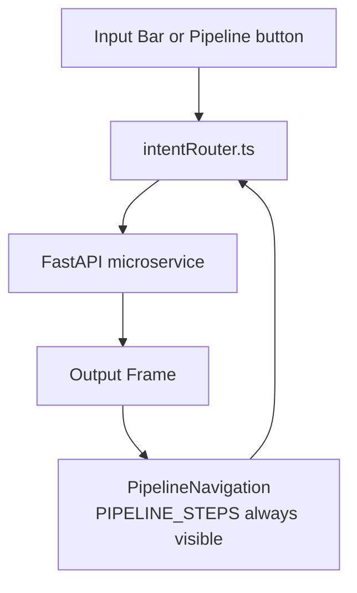
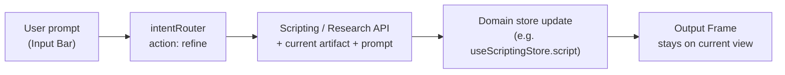

# Frontend Architecture & Design

## Overview

The frontend is a **Next.js 16** conversational creative studio — inspired by **Google Flow** — not a rigid multi-step form. Users work in a single full-screen canvas: a hero **Output Frame** shows whatever matters right now, a **Pipeline Navigation** bar exposes all six workflow steps at the bottom, and an **Input Bar** accepts natural language or button clicks.

The four-stage [workflow](./workflow.md) still exists on the backend; the UI never exposes stage tabs. Intent (typed or clicked) routes to the right service and updates the Output Frame.

The browser never talks to backend ports directly. All API calls go to `/api/v1/projects/:projectId/...` on `localhost:3000`; `next.config.ts` reverse-proxies to the correct FastAPI service.

---

## Tech Stack

| Layer | Choice | Notes |
|-------|--------|-------|
| Framework | **Next.js 16.2.9** | App Router, Turbopack |
| Styling | **Tailwind CSS** | Dark charcoal studio theme — see [Visual Design](./visual-design.md) |
| Typography | **Inter** or **Satoshi** | Clean, modern UI font |
| Icons | **Lucide React** | Pipeline nav chips, format toggle |
| State | **Zustand** | Studio shell + domain stores |
| Port | **3000** | `npm run start` (production mode) |

> Use `npm run start` over `npm run dev` for stability when integrating with live backend services.

Visual tokens, component specs, and mode accents: **[Visual Design](./visual-design.md)**

---

## Flow Interface Layout

Single-page studio shell — no sidebars, no stage tabs. **Viewport-locked** — the app fills exactly one screen; only view panels scroll internally.

```
┌─────────────────────────────────────────────────────────────┐  h-screen
│  Project Name                                               │  shrink-0
├─────────────────────────────────────────────────────────────┤
│                    BIG OUTPUT FRAME                         │  flex-1 min-h-0
│              (internal scroll per view panel)               │
│              Content Format  [ Long ▎ Short ]               │  shrink-0
│         ╭─────────────────────────────────────────────────╮ │
│         │ Explore Trends → … → SEO & Publish  [Add Audio] │ │
│         ╰─────────────────────────────────────────────────╯ │
│  +  │  What do you want to do next?                    →   │
└─────────────────────────────────────────────────────────────┘  overflow-hidden
```

### Viewport & layout model

The studio is a **fixed full-screen app** — no document-level scrolling.

| Layer | Classes / behavior | Role |
|-------|-------------------|------|
| **App shell** (`StudioShell`) | `h-screen overflow-hidden flex flex-col` | Locks to viewport height; disables global scrollbars |
| **Header** | `shrink-0` | Fixed height, never compresses |
| **Output Frame** | `flex-1 min-h-0` | **Dynamically fills** all remaining vertical space between header and bottom dock |
| **Bottom dock** (`ControlDock` + Input Bar) | `shrink-0` | Content Format, Pipeline Navigation, prompt input — natural height |

**Why `min-h-0`:** In a flex column, the default `min-height: auto` prevents children from shrinking below content size. `min-h-0` on the Output Frame lets it stretch and shrink to exactly the available gap — replacing any rigid `min-h-[65vh]` or percentage-based height.

**Internal scroll only:** Each view panel (`TrendsView`, `ScriptView`, etc.) wraps content in `h-full min-h-0 overflow-y-auto`. Long scripts, trend grids, and scene galleries scroll **inside** the canvas — the page never scrolls.

```tsx
// StudioShell.tsx
<div className="flex h-screen flex-col overflow-hidden bg-studio-bg">
  <ProjectHeader className="shrink-0" />
  <OutputFrame className="min-h-0 flex-1" />
  <ControlDock className="shrink-0" />
  <PromptInputBar className="shrink-0" />
</div>

// views/ScriptView.tsx
<div className="h-full min-h-0 overflow-y-auto p-6">{/* content */}</div>
```

### Zone 1 — Thin Header

Minimal chrome. **Project name only** — no format control here. Keeps the top bar clean and leaves the Output Frame as the visual focus.

| Element | User-facing label | Component | Notes |
|---------|-------------------|-----------|-------|
| Project name | — | `ProjectHeader` | Truncated, clickable → project settings |

### Zone 2 — Output Frame (Hero)

**The Output Frame is always the star.** It dynamically fills **all remaining height** between the header and bottom dock (`flex-1 min-h-0`) and shows exactly one primary view at a time.

| View mode | Renders when | Content / Features |
|-----------|--------------|-------------------|
| `welcome` | New / empty project | Content Format explanation, suggested first prompt |
| `trends` | Trend exploration | Card grid of trend results (format-aware) |
| `facts` | Fact finding / summarize | Summaries, source citations |
| `script` | Script written or editing | Controlled inline-editable script, word count, and real-time outline segment syncing. |
| `scenes` | Scene pictures generated | Image gallery grid. Supports downloading scenes (`.jpg`), custom client-side uploads (`FileReader` data URLs), individual card regeneration, and a Pexels & Pixabay stock search drawer. |
| `video` | Scene videos / compiling | Storyboard video timeline compilation. Supports downloading clips (`.mp4`), custom client-side uploads, individual video clip regeneration, and a Pexels & Pixabay stock search drawer. |
| `ffmpeg` | Video rendering | Full rendering progress view with dynamic polling. Final video player contains a hover actions overlay (Download and Regenerate) positioned directly inside the video player frame. |
| `seo` | SEO & publish | Title candidates (with copy click handler), YouTube description (with copy button in section header), metadata tags (with Individual and Copy All hashtag actions prepending `#`), and a thumbnail preview card (16:9/9:16 aspect) with hover overlays (download, upload, regenerate) and a persistent editable prompt caption. |

**Component:** `OutputFrame` — switches on `useStudioStore.activeView`. Sub-components per mode (`TrendsView`, `ScriptView`, `SceneGalleryView`, `SceneVideosView`, `VideoView`, `SeoView`).

**Inline editing & real-time sync (script view):**
- `ScriptView` renders a controlled `<textarea>` bound to `useScriptingStore.script`.
- User edits directly in the Output Frame. Word and character counts update in real-time.
- Manual script narration edits are dynamically parsed to automatically update and sync the Storyboard Outline segments and style tags in the store.
- Manual edits write to the store immediately.
- NL refinement ("make the script darker") calls `refine` → API → **replaces** store content → frame re-renders with the updated outline.
- User can also click **Write Script** again to full re-generate from upstream research (confirms if script has manual edits).

**Rules:**
- One hero view at a time — no split panels unless user explicitly opens a detail overlay.
- Loading states render *inside* the frame (skeleton / shimmer), not in a modal.
- Content Format switch re-layouts previews (16:9 vs 9:16) without leaving the current view.
- **No page scroll** — overflow lives on the inner view container only (`overflow-y-auto`).

### Zone 3 — Content Format (above Pipeline Navigation)

**Placement:** `ContentFormatToggle` is **not** in the header. It sits **centered directly above** the Pipeline Navigation pill — part of the bottom control stack, always visible while working.

| Property | Value |
|----------|-------|
| Position | Top of `ControlDock` (`shrink-0`), centered horizontally, `mb-2` above pipeline pill |
| Alignment | `flex flex-col items-center` — label + segmented control stacked |
| Grouping | Wrapped with Pipeline Navigation in `ControlDock.tsx` |

User-facing label: **Content Format**. Component: `ContentFormatToggle`.

See [Content Format](#content-format--global-propagation).

**Why here, not the header:** Groups format with the pipeline and Input Bar. Header stays minimal; the control sits where the user acts.

### Zone 4 — Pipeline Navigation

Floating pill at the top of the bottom dock, above the Input Bar. **All six pipeline steps are always fully visible, active, and in fixed sequential order** — users can jump to any step at any time (linear or not).

```
Explore Trends → Fact Finder → Write Script → Scene Pictures → Scene Videos → SEO & Publish
```

**Component:** `PipelineNavigation` (may wrap legacy `QuickControls.tsx` name). Two render paths:

1. **Pipeline buttons** — fixed list from `PIPELINE_STEPS` in `lib/pipelineNav.ts` (always all six)
2. **Add Audio toggle** — from `useProjectStore.addAudioEnabled`, rendered at the end of the pill (separate from pipeline steps)

| Step | Label | `StudioAction` | Output view | API |
|------|-------|----------------|-------------|-----|
| 1 | Explore Trends | `explore_trends` | `trends` | `POST /research/trends/short` or `/long` |
| 2 | Fact Finder | `fact_finder` | `facts` | `POST /research/web-search`, `/summarize` |
| 3 | Write Script | `write_script` | `script` | `POST /scripting/storyboard` |
| 4 | Scene Pictures | `scene_pictures` | `scenes` | Media pipeline (FLUX / Imagen) |
| 5 | Scene Videos | `scene_videos` | `video` | `POST /video/render` |
| 6 | SEO & Publish | `seo_publish` | `seo` | `POST /seo/titles`, `/metadata`, `/publish` |

**Behavior rules:**
- **Always visible** — no hiding, no `More` overflow, no contextual subset.
- **Always active** — every button is clickable; dispatches via `intentRouter` (may prompt if upstream data is missing).
- **Sequential layout** — left-to-right in pipeline order; use `→` separators or spacing between chips (see [Visual Design](./visual-design.md)).
- **Active step highlight** — the button matching `useStudioStore.activeView` gets a subtle ring/fill; does not disable other buttons.
- **Completed steps** (optional) — soft checkmark or dot when that step has data in its domain store; informational only.

```ts
// lib/pipelineNav.ts
export const PIPELINE_STEPS = [
  { id: "explore_trends",  label: "Explore Trends",  action: "explore_trends",  view: "trends"  },
  { id: "fact_finder",     label: "Fact Finder",     action: "fact_finder",     view: "facts"   },
  { id: "write_script",    label: "Write Script",    action: "write_script",    view: "script"  },
  { id: "scene_pictures",  label: "Scene Pictures",  action: "scene_pictures",  view: "scenes"  },
  { id: "scene_videos",    label: "Scene Videos",    action: "scene_videos",    view: "video"   },
  { id: "seo_publish",     label: "SEO & Publish",   action: "seo_publish",     view: "seo"     },
] as const;
```

Clicking a pipeline button:
1. Sets `activeView` to that step's view (shows existing data if present).
2. On explicit generate intent (or if view is empty), calls the corresponding API.

Users can **type or click** pipeline steps — both paths hit `intentRouter`.

### Add Audio toggle (not a pipeline step)

Lives in `useProjectStore.addAudioEnabled: boolean` — **persistent on/off state**, not a pipeline button.

```ts
interface ProjectStore {
  contentFormat: ContentFormat;
  addAudioEnabled: boolean;
  setContentFormat: (format: ContentFormat) => void;
  setAddAudioEnabled: (enabled: boolean) => void;
}
```

- Renders at the **end** of the pipeline pill (after SEO & Publish), always visible.
- Does **not** call an API on toggle alone; `includeAudio: addAudioEnabled` is sent with `POST /video/render`.
- Visual: filled when on (teal), outline when off — distinct from pipeline chips.

### Zone 5 — Input Bar

Bottom-fixed within the flex column (`ControlDock` + `shrink-0`), not document scroll.

```
┌──────────────────────────────────────────────────────────┐
│ [Upload] │  What do you want to do next?             →  │
└──────────────────────────────────────────────────────────┘
```

| Part | Behavior |
|------|----------|
| `Upload` (icon) | Direct trigger for browser file selection. Supports image, video, script/text, and JSON attachments. |
| Attachment Badge | Renders the filename of the attached asset with a "×" remove trigger once selected. |
| Text field | Natural language — "make the script darker", "generate 6 scene images", "add voiceover". |
| `→` Send | Submit prompt & attachment metadata to the intent router. |

**Component:** `PromptInputBar` — on submit, calls `lib/intentRouter.ts` which maps NL → action + API call + `activeView` update.

**Auto-routing and Store Integration:**
- Attaching a local file automatically prepends a category tag prefix (e.g. `[Category: images]`) based on its file extension/type.
- The intent router (`intentRouter.ts`) processes these tags to instantly navigate the UI to the correct view (e.g., `images` category maps to `scene_pictures`).
- File contents sync directly to state stores client-side upon prompt submission (e.g., text/JSON uploads replace narration scripts, images override thumbnails, videos override compile previews).

Users can **type or click** pipeline steps — both paths hit the same action handlers.

---

## Workflow Mapping (UI ↔ Backend)

The studio supports **non-linear navigation** — all six pipeline buttons are always available. Typical happy path:

| User action | Output Frame (`activeView`) | Pipeline highlight |
|-------------|----------------------------|-------------------|
| Starts project | `welcome` | — (all six buttons visible) |
| **Explore Trends** (step 1) | `trends` | Step 1 active |
| **Fact Finder** (step 2) | `facts` | Step 2 active |
| **Write Script** (step 3) | `script` | Step 3 active |
| **Scene Pictures** (step 4) | `scenes` | Step 4 active |
| **Scene Videos** (step 5) + Add Audio toggle | `video` | Step 5 active |
| **SEO & Publish** (step 6) | `seo` | Step 6 active |
| "make the script darker" (refine) | current view updates | active step unchanged — see [Refinement Loop](#refinement-loop) |

User can click **any** pipeline step out of order — e.g. jump to Write Script before Fact Finder (router may warn or use partial context).



---

## Content Format — Global Propagation

The **Content Format** control (`Long` | `Short`) is **centered above the Pipeline Navigation pill** in the bottom control stack — always visible, never in the header. One switch reshapes generation across the entire studio — Output Frame layout, pipeline behavior, and every API payload.

### Component

| Segment | Label | Icon | Aspect |
|---------|-------|------|--------|
| Long-form | `Long` | `Film` (16:9) | 1920×1080 |
| Short | `Short` | `Smartphone` (9:16) | 1080×1920 |

Segmented pill with slide animation. Active segment: filled; inactive: muted.

### State

```ts
type ContentFormat = "long" | "short";

interface ProjectStore {
  contentFormat: ContentFormat;   // default: "long"
  addAudioEnabled: boolean;
  setContentFormat: (format: ContentFormat) => void;
  setAddAudioEnabled: (enabled: boolean) => void;
}

// useProjectStore initial state
const defaultState = { contentFormat: "long" as const, addAudioEnabled: false };
```

**Propagation rules:**
1. `contentFormat` lives only in `useProjectStore`.
2. **Default is `long`** — every new project starts in Long-form mode until the user switches.
3. Every API request includes `contentFormat` in the body.
4. Output Frame previews re-aspect immediately on switch.
5. Switching does not wipe work — show a dismissible banner only when stale data exists (see [UX Enhancements](#ux-enhancements)).
6. **Format changes persist instantly** — `setContentFormat` writes through Zustand `persist` on `useProjectStore`; no save button, survives refresh.

### Default & Adaptation Behavior

The Content Format control is one of the most important in the app — it affects generation, UI presentation, prompt interpretation, and Quick Control suggestions. Flipping it should feel like switching studio modes, not just a cosmetic label change.

#### What the user experiences when they toggle

| Moment | User sees |
|--------|-----------|
| **Immediate** | Content Format segment animates to the new selection; Output Frame previews re-layout (16:9 ↔ 9:16) without leaving the current view |
| **If stale data exists** | Dismissible banner in Output Frame: *"Switched to Short mode. Previews updated. Re-run current step for best results."* — only shown when domain stores contain artifacts generated under the previous format |
| **Next action** | Any button click or Input Bar submit generates content in the new format — script length, scene layout, and render settings all match |
| **Welcome state** | Copy and suggested first prompt update to describe Long vs Short workflow |

The toggle affects **both** what gets generated (backend) and how it is presented (frontend previews, targets, copy).

#### Adaptation matrix

| Aspect | Default (`long`) | When **Long** is selected | When **Short** is selected |
|--------|------------------|---------------------------|----------------------------|
| **Default on new project** | `long` | — | — |
| **Trend exploration** | Long trends | `POST /research/trends/long` | `POST /research/trends/short` |
| **Research focus** | In-depth | Transcripts, chapters, watch time | Hooks, retention, first 3 seconds |
| **Script generation** | Longer format | 8–15 min, structured, roadmap-style hooks | 15–60 sec, pattern interrupt, strong hook focus |
| **Output Frame previews** | 16:9 | Horizontal image & video previews | Vertical (9:16) image & video previews |
| **Video render** | Higher quality | Higher bitrate, horizontal safe zones | Fast preset, vertical safe zones, text overlays |
| **Prompt behavior** | Long-oriented | Input Bar prompts interpreted as long-form | Prompts interpreted as short-form |
| **Pipeline Navigation** | Long flow | All six steps visible; format-aware labels (future) | Same six steps; hook-first copy when Short |
| **SEO** | Full metadata | ~70 char titles, chapters | ~40 char titles, hashtags, no chapters |

Presets and limits live in `lib/contentFormat.ts` — components read from there, never hardcode values.

#### Input Bar adaptation

When the user types naturally (e.g. *"write a script about dark electronic music"*), `intentRouter` **always** reads `useProjectStore.contentFormat` before building the request:

```ts
// intentRouter passes format into every generation payload
dispatch("write_script", {
  prompt: userInput,
  contentFormat: useProjectStore.getState().contentFormat,
});
```

The same words produce different outputs depending on format — Long yields a structured multi-section script; Short yields a tight hook-first script. Refinement prompts (`refine` action) also include `contentFormat` so edits stay within the selected mode.

#### Pipeline Navigation adaptation

All six `PIPELINE_STEPS` are **always rendered** regardless of format. Format affects generation payloads and optional UI polish:

- Button labels can use `CONTENT_FORMAT_PRESETS` for format-aware copy (future enhancement).
- Active step highlight uses mode accent (indigo Long / violet Short).
- `activeView` syncs with the clicked pipeline button — clicking **SEO & Publish** always opens `seo` view.

```ts
// Pipeline buttons never filtered — only highlight changes
PIPELINE_STEPS.map((step) => (
  <PipelineButton
    key={step.id}
    active={useStudioStore.activeView === step.view}
    onClick={() => intentRouter.dispatch(step.action)}
  />
));
```

#### Implementation reference

```ts
// lib/contentFormat.ts
export const CONTENT_FORMAT_PRESETS = {
  long: {
    aspectRatio: "16:9",
    resolution: { width: 1920, height: 1080 },
    scriptTargetMinutes: [8, 15],
    scriptTargetWords: [1200, 2000],
    trendsEndpoint: "/research/trends/long",
    titleMaxChars: 70,
  },
  short: {
    aspectRatio: "9:16",
    resolution: { width: 1080, height: 1920 },
    scriptTargetSeconds: [15, 60],
    scriptTargetWords: [40, 150],
    trendsEndpoint: "/research/trends/short",
    titleMaxChars: 40,
  },
} as const;
```

---

## State Management (Zustand)

| Store | Scope | Holds |
|-------|-------|-------|
| `useProjectStore` | Global | `contentFormat`, `addAudioEnabled`, project meta |
| `useStudioStore` | UI shell | `activeView`, `promptHistory`, loading |
| `useResearchStore` | Data | Trends, facts, summaries |
| `useScriptingStore` | Data | Script, storyboard, thumbnail concepts |
| `useMediaStore` | Data | Scene images, render `taskId`, `renderStatus`, video URLs |
| `useSeoStore` | Data | Titles, metadata, publish status |

**Design rules:**
- `useStudioStore` owns *what the user sees*; domain stores own *what was generated*.
- **`activeView` syncs with Pipeline Navigation** — clicking a step sets the view; the matching button gets active highlight.
- `intentRouter` is the only place that maps prompts → API + view transitions.
- API helpers always merge `contentFormat` and `includeAudio` (from `addAudioEnabled`) into relevant payloads.

---

## Refinement Loop

NL edits ("make the script darker", "shorten scene 3", "regenerate with more energy") are first-class — they keep the conversational feel without leaving the Output Frame.



### How refinement works

1. **Intent detection** — `intentRouter` classifies NL as `refine` when `activeView` is set and the prompt looks like an edit (vs a new action). Falls back to `refine` if user is on `script` view and prompt is ambiguous. **v1 uses keyword/heuristic matching** — sufficient for common patterns ("make", "shorter", "darker", "regenerate"). Can be upgraded later to a lightweight LLM intent classifier if ambiguity becomes a pain point.
2. **Context payload** — router sends current artifact from the active domain store + user prompt + `contentFormat`:
   ```ts
   POST /scripting/storyboard  // or a dedicated /refine endpoint later
   { script: currentScript, instruction: "make it darker", contentFormat }
   ```
3. **Store update** — API response **replaces** the relevant store field (`script`, `summaries`, scene metadata). Manual inline edits are overwritten unless user confirmed.
4. **Frame** — stays on the same `activeView`; content re-renders in place. Optional brief highlight on changed paragraphs.
5. **Pipeline Navigation** — unchanged by refinement; all six buttons stay visible; `activeView` highlight stays on current step.
6. **History** — `useStudioStore.promptHistory` appends `{ prompt, action, contentFormat, timestamp }` for undo/debug (v1: display-only; v2: undo stack). Including `contentFormat` helps users understand why a given result was generated.

### Refinement by view

| `activeView` | Store touched | Example prompt |
|--------------|---------------|----------------|
| `script` | `useScriptingStore.script` | "make the hook more aggressive" |
| `facts` | `useResearchStore.summaries` | "focus more on competitor X" |
| `trends` | `useResearchStore.trends` | "filter to videos under 60 seconds" |
| `scenes` | `useMediaStore.sceneImages` | "regenerate scene 2 with neon lighting" |
| `video` | re-dispatch render | "add voiceover" → sets `addAudioEnabled`, re-runs render |
| `seo` | `useSeoStore` titles/metadata | "make titles more clickbaity" |

---

## Intent Router

`lib/intentRouter.ts` — single entry for Input Bar and Pipeline Navigation.

```ts
type StudioAction =
  | "explore_trends"
  | "fact_finder"
  | "write_script"
  | "scene_pictures"
  | "scene_videos"
  | "seo_publish"
  | "refine";

async function dispatch(action: StudioAction, payload: { prompt?: string }) {
  // 1. Resolve API call from action + contentFormat + store state
  // 2. Set useStudioStore.activeView from PIPELINE_STEPS (skip if refine)
  // 3. Call API, update domain store
}
```

NL prompts use lightweight keyword/intent matching; ambiguous prompts default to the step matching `activeView`. All six pipeline actions map 1:1 to `PIPELINE_STEPS`.

---

## API Consumption

```ts
const { contentFormat } = useProjectStore.getState();

fetch(`/api/v1/projects/${projectId}/research/web-search`, {
  method: "POST",
  body: JSON.stringify({ ...payload, contentFormat }),
});
```

### Proxy routing (`next.config.ts`)

| Frontend path prefix | Proxied to |
|----------------------|------------|
| `/api/v1/projects/:id/research/*` | Research `:8001` |
| `/api/v1/projects/:id/scripting/*` | Scripting `:8002` |
| `/api/v1/projects/:id/thumbnails/*` | Scripting `:8002` |
| `/api/v1/projects/:id/stock/*` | Media `:8003` |
| `/api/v1/projects/:id/video/*` | Media `:8003` |
| `/api/v1/projects/:id/seo/*` | SEO `:8004` |
| `/api/v1/projects/:id/publish` | SEO `:8004` |

Full endpoint list: [API Routing](./api-routing.md)

---

## Async Patterns

### Video render

Render progress shows **inside the Output Frame** (`video` view):

1. `POST /video/render` → `taskId`
2. Poll `GET /video/render/:taskId/status` until terminal state
3. On complete, swap skeleton for video player

### Everything else

Inline loading in Output Frame — no blocking modals.

---

## Persistence

Studio state should survive refresh. Use Zustand `persist` middleware with `localStorage` keyed per project.

| Store | Persist? | Keys | Notes |
|-------|----------|------|-------|
| `useProjectStore` | Yes | `contentFormat`, `addAudioEnabled` | Per `projectId`; **format changes save on every toggle** |
| `useStudioStore` | Yes | `activeView`, `promptHistory` | Restore user to last canvas |
| `useResearchStore` | Yes | `trends`, `summaries` | Avoid re-fetching on reload |
| `useScriptingStore` | Yes | `script`, `storyboard` | Includes manual inline edits |
| `useMediaStore` | Yes | `sceneImages`, `videoUrl`, `taskId`, `renderStatus` | Re-poll if `taskId` non-terminal; restore in-progress UI from `renderStatus` (no fresh skeleton on refresh) |
| `useSeoStore` | Optional | titles, metadata | Only if SEO flow is active |

```ts
// stores/useStudioStore.ts
persist(
  (set) => ({ activeView: "welcome", promptHistory: [], ... }),
  { name: `studio-${projectId}` }
);
```

On mount: if `taskId` exists and `renderStatus` is non-terminal (`pending` | `in_progress`), resume polling and show the last known progress state immediately — not a blank skeleton.

```ts
// useMediaStore — renderStatus persisted alongside taskId
renderStatus: "idle" | "pending" | "in_progress" | "complete" | "failed";
```

**Not persisted:** transient `loading` flags, debounced edit buffers (flush to store before unload).

---

## Expected Directory Layout

```
frontend/
├── app/
│   └── projects/[projectId]/page.tsx   # Single studio page
├── components/
│   ├── layout/
│   │   ├── StudioShell.tsx             # Full layout orchestrator
│   │   └── ProjectHeader.tsx           # Thin header (project name only)
│   ├── studio/
│   │   ├── ControlDock.tsx             # Bottom stack: Content Format + Pipeline Nav
│   │   ├── ContentFormatToggle.tsx     # Centered above pipeline pill
│   │   ├── PipelineNavigation.tsx      # All 6 steps, always visible
│   │   ├── OutputFrame.tsx             # View switcher
│   │   ├── PromptInputBar.tsx          # Bottom NL input
│   │   └── views/                      # TrendsView, ScriptView, etc.
├── stores/
│   ├── useProjectStore.ts
│   ├── useStudioStore.ts
│   ├── useResearchStore.ts
│   ├── useScriptingStore.ts
│   ├── useMediaStore.ts
│   └── useSeoStore.ts
├── lib/
│   ├── api.ts
│   ├── intentRouter.ts
│   ├── pipelineNav.ts                  # PIPELINE_STEPS constant
│   └── contentFormat.ts
└── next.config.ts
```

---

## UX Enhancements

Practical improvements that fit the simple Flow-style studio. Prioritized for implementation planning.

### High priority — Format change feedback

When the user switches Long ↔ Short:

- Show a **dismissible** banner inside the Output Frame (not a modal): *"Switched to Short mode. Previews updated. Re-run current step for best results."*
- Only appear if **stale data exists** — i.e. any domain store holds artifacts that were generated under the previous format.
- Banner includes an optional **re-generate chip** (see below) for the current step.
- No banner on welcome/empty projects — previews still re-aspect immediately.

### High priority — Format-aware welcome state

`welcome` view shows different suggested first prompts based on `contentFormat`:

| Format | Suggested prompt |
|--------|------------------|
| Long | *"Explore trends in dark electronic music for long-form"* |
| Short | *"Find viral hooks for dark electronic Shorts"* |

Placeholder text in the Input Bar should also adapt. Makes the active mode obvious from the first second.

### Medium priority — Re-generate for current format

After a format switch with stale data, surface a re-generate chip in the Output Frame banner (targets the current `activeView` pipeline step).

- *"Re-generate script for Short"*
- *"Re-render scenes vertically"*

Maps to the same `intentRouter` actions with current `contentFormat` — an escape hatch without manual redo. Shown alongside the dismissible banner.

### Medium priority — Visual polish for Content Format

Subtle ambient feedback when format changes — see [Visual Design](./visual-design.md#mode-differentiation):

- Long → indigo accent on Output Frame border (`#6366F1`)
- Short → violet accent (`#A855F7`)

Implemented via `data-format` on `StudioShell` and CSS variables. Confirms the mode changed beyond the Content Format toggle animation alone.

### Nice to have — Smart format detection

When user pastes a YouTube URL via the `+` attachment area:

1. Detect Short vs long-form (URL pattern or metadata).
2. Show non-intrusive suggestion: *"This looks like a Short. Switch to Short mode?"*
3. One-click applies `setContentFormat("short")` — never auto-switch without consent.

### Nice to have — Keyboard shortcut

| Shortcut | Action |
|----------|--------|
| `Cmd/Ctrl + Shift + F` | Toggle Content Format |

Power-user affordance; does not clutter the visible UI.

### Minor — Format in prompt history

Each `promptHistory` entry stores `contentFormat` at send time. Useful when reviewing why a script came back long-form vs short-form. Display as a small badge in history UI (v2).

---

## Design Principles

1. **Output Frame is the hero** — flex-fills remaining viewport; scroll only inside view panels.
2. **Conversational, not procedural** — type or click; no stage tabs, no wizard steps.
3. **Pipeline Navigation** — all six steps always visible, active, sequential; Add Audio is a separate toggle at the end of the pill.
4. **Content Format first** — Content Format control above Pipeline Navigation; propagates to frame, pipeline, and APIs.
5. **Single origin** — all API traffic through Next.js proxy.
6. **Thin client** — intent routing and UI state in frontend; generation logic in FastAPI.
7. **Poll, don't block** — video renders poll status; progress lives in the Output Frame.
