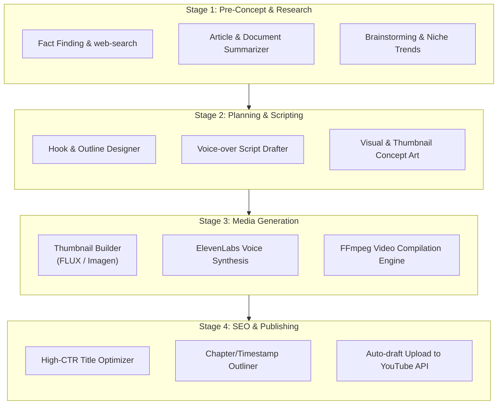

# Creator Workflow

Creator Copilot guides a project through **four sequential stages**. Each stage contains focused modules that map to a backend microservice and one or more API endpoints.



---

## Stage 1 — Pre-Concept & Research

**Service:** Research (`:8001`)

| Module | What it does | API |
|--------|--------------|-----|
| **Fact Finding & web-search** | Pulls transcripts from YouTube URLs, runs web research, synthesizes findings via Gemini | `POST /research/web-search` |
| **Article & Document Summarizer** | Condenses transcripts, articles, and research into a creator brief | `POST /research/summarize` |
| **Brainstorming & Niche Trends** | Live YouTube trend scans for shorts and long-form in a niche | `POST /research/trends/short`, `POST /research/trends/long` |

**Integrations:** `yt-dlp`, `youtube_transcript_api`, Gemini API (`GEMINI_API_KEY` in `services/research/.env`)

**Output → Stage 2:** Niche insights, competitor analysis, summarized brief.

---

## Stage 2 — Planning & Scripting

**Service:** Scripting (`:8002`)

| Module | What it does | API |
|--------|--------------|-----|
| **Hook & Outline Designer** | Structures the opening hook and full video outline | `POST /scripting/storyboard` |
| **Voice-over Script Drafter** | Generates narration-ready script from outline + research | `POST /scripting/storyboard` |
| **Visual & Thumbnail Concept Art** | Conceptualizes thumbnail direction; grades concepts for CTR potential | `POST /scripting/storyboard`, `POST /thumbnails/:assetId/grade` |

**Output → Stage 3:** Storyboard, VO script, thumbnail concepts.

---

## Stage 3 — Media Generation

**Service:** Media (`:8003`) + Celery worker

| Module | What it does | API / Integration |
|--------|--------------|-------------------|
| **Thumbnail Builder (FLUX / Imagen)** | Generates final thumbnail images from approved concepts | Image gen models (FLUX / Imagen) |
| **ElevenLabs Voice Synthesis** | Converts VO script to audio track | ElevenLabs API |
| **FFmpeg Video Compilation Engine** | Assembles stock footage, voice, and graphics into final video | `POST /video/render`, `GET /video/render/:taskId/status` |

Supporting endpoints for asset sourcing & storyboard gallery search:

| Module | API |
|--------|-----|
| Stock images / scene pictures search | `POST /stock/search` |
| Stock video clips search | `POST /stock/videos` |

**Async flow:** `video/render` dispatches a Celery task via Redis; client polls `status` until complete.

**Output → Stage 4:** Rendered video file, custom thumbnail, audio assets.

---

## Stage 4 — SEO & Publishing

**Service:** SEO (`:8004`)

| Module | What it does | API |
|--------|--------------|-----|
| **High-CTR Title Optimizer** | Generates title candidates optimized for click-through | `POST /seo/titles` |
| **Chapter/Timestamp Outliner** | Produces description, tags, and chapter timestamps | `POST /seo/metadata` |
| **Auto-draft Upload to YouTube API** | Pushes video + metadata as a draft to YouTube | `POST /publish` |

**Output:** Publish-ready YouTube draft with optimized metadata.

---

## Stage → Service Map

```
Stage 1  Pre-Concept & Research   →  Research Service   :8001
Stage 2  Planning & Scripting     →  Scripting Service  :8002
Stage 3  Media Generation         →  Media Service      :8003  (+ Celery)
Stage 4  SEO & Publishing         →  SEO Service        :8004
```

The Next.js studio UI exposes this four-stage flow as a continuous, non-linear 6-step pipeline navigation dock:
Explore Trends (Stage 1) → Fact Finder (Stage 1) → Write Script (Stage 2) → Scene Pictures (Stage 3) → Scene Videos (Stage 3) → SEO & Publish (Stage 4).
